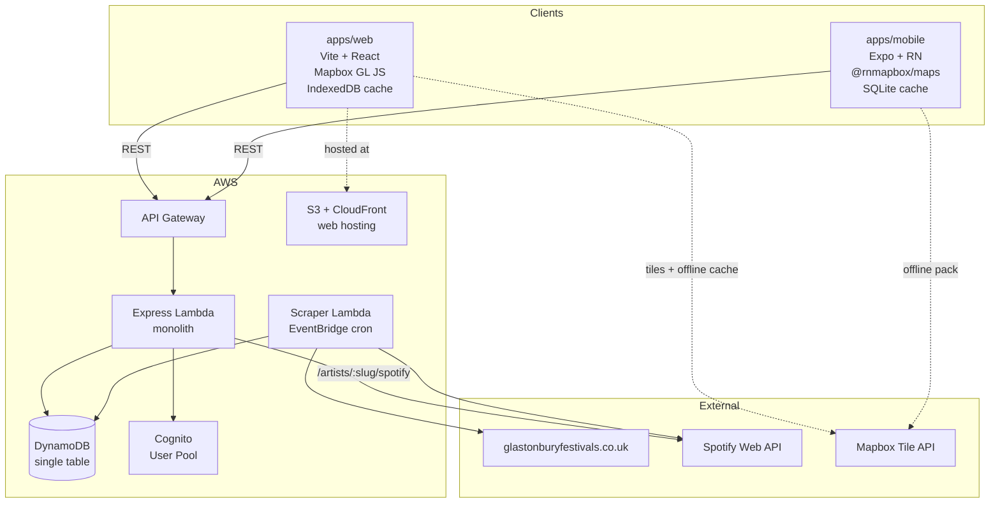

# Architecture

## System Overview

## Component Breakdown

| Component | Responsibility |
|---|---|
| `apps/web` | Vite + React + Tailwind PWA. Browses lineup, manages favourites, shows map. |
| `apps/mobile` | Expo + React Native app. Same flows as web with native map + offline packs. |
| `packages/shared` | TypeScript types, Zod schemas, typed API client, TanStack Query hooks reused by both apps. |
| `packages/ui` | Cross-platform headless primitives (where worth sharing). |
| `backend/` | Express monolith deployed as Lambda. Routes: `/lineup`, `/artists`, `/stages`, `/me/*`. |
| `scraper/` | Scheduled Lambda that scrapes the official site and writes to DynamoDB. |
| `infrastructure/` | Nested CloudFormation stacks (DynamoDB, API, scraper, Cognito, S3+CF, monitoring). |

## Data Flow

1. **Ingest:** EventBridge → Scraper Lambda → fetches HTML from `glastonburyfestivals.co.uk` → parses with Cheerio → resolves Spotify IDs via Client Credentials → batch writes to DynamoDB.
2. **Browse:** Client fetches `/lineup/:year` (cached with ETag) → renders list → favourite tap writes to local cache and (if signed in) `/me/favourites`.
3. **Artist:** Client opens artist page → fetches `/artists/:slug/spotify` (1h cached at API) → renders embed + deep-link.
4. **Map:** Client renders Mapbox map → tiles fetched from Mapbox API → Service Worker / native offline pack serves from cache when offline.

## Technology Stack

See [`TOOLS_AND_TECH.md`](TOOLS_AND_TECH.md).

## Infrastructure

- **Compute:** AWS Lambda (monolith Express handler via `serverless-http`).
- **API:** API Gateway REST.
- **Database:** DynamoDB single table with one GSI.
- **Hosting:** S3 + CloudFront (OAC, no public bucket access).
- **Auth:** Cognito user pool, optional sign-in.
- **Environments:** `dev` and `prod` Cognito + DynamoDB stacks.

## Security Considerations

- All API endpoints under HTTPS (CloudFront + API Gateway).
- Cognito JWTs verified by `aws-jwt-verify` middleware.
- Spotify and Mapbox secrets in AWS Secrets Manager; never in client code.
- Mapbox tokens scoped: web public restricted (URL allowlist), mobile download token.
- S3 buckets: encryption at rest, versioning, point-in-time recovery on DynamoDB, no public access.
- Service Worker only caches GETs from same-origin and the Mapbox bbox.

## Scalability Notes

- DynamoDB on-demand billing; partition keys distribute well (year + perfId, user + perfId).
- Lambda scales horizontally; cold starts mitigated by keeping it monolithic + provisioned concurrency if needed.
- Spotify API is the choke point — all calls happen at scrape time and cached in DynamoDB; runtime calls are 1h API-cached.

## Key Components and Their Interactions

- `backend/src/routes/lineup.ts` reads `Performance` items via `adapters/dynamodb-lineup.ts`, with `controllers/lineup.ts` handling response shaping and ETag.
- `backend/src/routes/favourites.ts` (Cognito-auth) writes via `adapters/dynamodb-favourites.ts`.
- `scraper/handler.ts` calls `scraper/src/parse.ts` (Cheerio) → `scraper/src/spotify-resolve.ts` (uses backend `lib/spotify-client.ts`) → `adapters/dynamodb-lineup.ts` for upsert.

## External Dependencies

| Dependency | Used by | Notes |
|---|---|---|
| Spotify Web API | backend, scraper | Client Credentials flow; rate-limited; cached aggressively. |
| Mapbox | both apps | Custom style; offline cache via Service Worker (web) + offline pack (mobile). |
| `glastonburyfestivals.co.uk` | scraper | HTML scrape; structure changes annually — re-validate on new lineup release. |

## Recent Significant Changes

| Date | Change |
|---|---|
| 2026-05-21 | Project bootstrap, Phase 0 in progress. |
